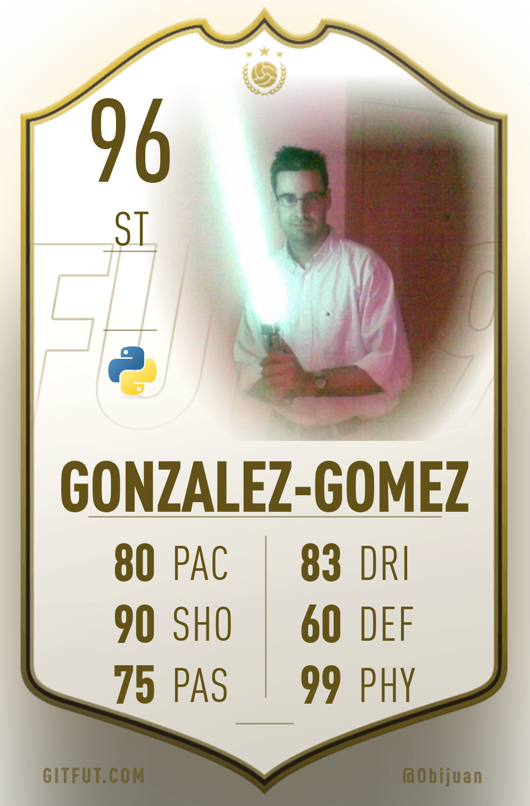
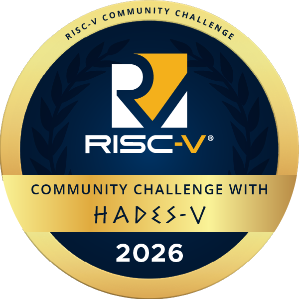

<!-- BOTON PARA CAMBIAR EL TEMA CLARO/OSCURO -->
<button class="btn js-toggle-light-mode">Tema claro</button>

# Juan González Gómez (Obijuan)

¡Hola! Soy Obijuan... y en este microtutorial... 🙂  
{: .fs-6 .fw-300 }  

## Presentacion

¡Hola! Soy Obijuan, un apasionado de la robótica y el **conocimiento libre**. Soy **Ingeniero de Telecomunicaciones** por la UPM, y **Doctor** en robótica por UAM. Me defino como un **Maker**. Mi convicción es que compartir es la clave para avanzar, por eso soy un firme defensor del movimiento del **software libre**, **hardware libre** y la **cultura libre**. En 2017 recibí el premio **O'Reilly Open Source Award** que se concede a personas que hayan destacado por su dedicación, innovación, liderazgo y contribución al software libre. Gracias a eso me hicieron una página en **wikipedia**, la enciclopedia libre, lo que me llena de orgullo 🙂: [Obijuan en Wikipedia](https://es.wikipedia.org/wiki/Juan_Gonz%C3%A1lez_G%C3%B3mez)  

## Redes sociales

* [][Github]  
* [][Youtube]
* [][Mastodon]  
* [][Linkedin]
* [][X/Twitter]  

## Insignias

* [Scout report](https://gitfut.com/Obijuan)

  

* 🥇[RISC-V Community Challenge with HaDes-V](https://www.credly.com/badges/9d9c0b64-5846-4172-b172-3752144590a6). Linux fundation
  

## Aplicaciones

* [Apio](https://github.com/FPGAwars/apio/wiki): Sintetiza fácilmente tus diseños en FPGAs Libres desde la línea de comandos  
* [Icestudio](https://github.com/FPGAwars/icestudio/wiki): Herramienta gráfica para dibujar circuitos digitales y cargarlos en FPGAs Libres  

## Proyectos
* [icerv-dasm](https://github.com/Obijuan/icerv-dasm). Mini desensamblador y simulador para RISCV escrito en RUST
* [JANEL-OS](https://github.com/Obijuan/JANEL-OS). Mini-kernel para la multiplexación de 2 tareas en el Risc-V de la Raspberry Pi pico2    
* [Simplez FPGA]. Implementación del procesador SIMPLEZ en la FPGA de la tarjeta Alhambra-II
* [Nand2Tetris Icestudio]. Implementación del procesador HACK del famoso curso Nand2tetris, y todos sus bloques, en Icestudio
* [Z80 FPGA]. Implementación del procesador Z80 en Icestudio
* [RISC-V-FPGA]. Procesador RISC-V para FPGAs Libres, en Icestudio 
* [RiscvForth]. Implementación de Forth para procesadores RISCV32
* [EDSAC-icestudio]. Implementación del computador EDSAC en Icestudio 
* [Icebot]. Robot imprimible minimalista, para la placa con FPGA Icezum Alhambra
* [SAP-1-FPGA]. Implementación del procesador SAP-1 (Simple as Possible) en Icestudio
* [Obiscad]. Herramientas para OpenScad
* [iceFactory]. Biblioteca Javascript para generar bloques para Icestudio 
* [ACC]. ACC (Apollo CPU Core) en Verilog, para FPGAs libres
* [ArduSnake]. Biblioteca de robots modulares para Arduino
* [Venus-RISCV-examples]. Ejemplos en ensamblador del RISCV para el simulador VENUS del VSCode

## Cursos

* Arquitectura de computadores. Procesador **RISC-V**
  * [Laboratorio](https://github.com/myTeachingURJC/2019-20-LAB-AO/wiki)  
  * [Teoría](https://github.com/myTeachingURJC/Arq-computadores-01/wiki)  
* [Laboratorio de Tecnologías Audiovisuales en la Web](https://github.com/myTeachingURJC/2024-2025-LTAW/wiki)  (Curso 2024-2025)  
* [Mecatrónica](https://github.com/myTeachingURJC/Mecatronica/wiki)  

## WebApps

* [WebFPGA-tools](https://obijuan.github.io/Web-iceprog/wiki/web-iceprog/webFPGA-tools-04/): Herramientas web para la Alhambra-II: Reset, lectura de la flash, borrado, grabación de bitstreams...  
* [FPGA RetroHub](https://obijuan.github.io/Web-iceprog/wiki/web-iceprog/fpga-retrohub/): Configura la Alhambra-II para convertirla en máquinas retro fácilmente: ZX-Spectrum, Amstrad CPC, Arcade Defender y Space invaders  

## Tutoriales

* [Viaje al centro de los chips](https://github.com/Obijuan/Learn-open-silicon/wiki).   Notas y documentacion sobre el nivel más bajo de los circuitos: **transistores en silicio**  (🚧 En construcción 🚧)
* [Tutorial de Siliwiz: Construcción de un MOSFET desde 0](https://obijuan.github.io/Tutorial-Siliwiz). Ejemplo de uso de Siliwiz para construir un Mosfet N, simularlo y exportar el modelo 3D a FreeCAD
* [Electrónica Digital para makers con FPGAs Libres]. Aprende electrónica digital desde 0 con **Icestudio** en FPGAs Libres
* [Diseño Digital para FPGAs, con herramientas libres]. Aprende a diseñar circuitos digitales con **Verilog** en FPGAs Libres
* [Tutoriales de FreeCad]. Aprende a diseñar en 3D para impresoras 3D
* [Videoblog]. VideoBlog: Píldoras de conocimiento  
* [CTIF-2018-FPGAs]. Curso de DISEÑO DE SISTEMAS DIGITALES EN VERILOG USANDO FPGAS LIBRES. Centro: CTIF Madrid-capital, 2018 
* [CTIF-2018-FREECAD]. Curso de FreeCAD del CTIF Madrid-capital, 2018 

## Cuadernos técnicos

* [Cuadernos técnicos sobre FPGAs Libres]. Profundiza en el diseño de circuitos digitales en FPGAs Libres con **Icestudio**
* [ICESTUDIO-DIGITAL]. Axiomatización de la electrónica digital práctica, con FPGAs Libres
* [L1: Terminales: de la pluma al terminal]. Viaje por los terminales de texto, desde sus orígenes más artesanales hasta su forma actual en el sistema operativo Linux 
* [Learn-Python]. Sesiones sobre programación en python con VSCode 
* [FreeCAD Mechanical]. Láminas del libre AutoCAD Mechanical migradas a FreeCAD
* [FPGA-keyboard]. Documentación sobre teclados de PC. Control desde una FPGA Libre
* [Rusell]. Cimientos de los circuitos digitales en FPGAs libres
* [FPGA-PS2]. Controlador de teclados PS2 para FPGAs

## Colecciones para Icestudio

* [IceK](https://github.com/FPGAwars/iceK/wiki): Constants
* [IceWires](https://github.com/FPGAwars/iceWires/wiki): Wires and Buses 
* [IceIO](https://github.com/FPGAwars/iceIO/wiki): FPGA IO-pins
* [IceGates](https://github.com/FPGAwars/iceGates/wiki): Logic gates  
* [IceMux](https://github.com/FPGAwars/iceMux/wiki): Muxes and Demuxes  
* [IceCoders](https://github.com/FPGAwars/iceCoders/wiki): Binary Encoders and Decoders  
* [IceFF](https://github.com/FPGAwars/iceFF/wiki): Flip-Flops
* [IceRegs](https://github.com/FPGAwars/iceRegs/wiki): Registers
* [IceSRegs](https://github.com/FPGAwars/iceSRegs/wiki): Shift registers  

## Logs

Los Logs son las **notas en sucio**, escritas en un lenguaje coloquial y personal, que escribo cuando estoy aprendiendo sobre un tema o profundizando en él. Estos LOGs son la base para la escritura futura de Cuaderno técnicos, tutoriales o cursos. Son el equivalente a las notas que tomas en un cuaderno, pero lo hago en digital y en abierto

| Nombre                  | Descripción |
|-------------------------|-------------|
| [Experimentos con Magic](https://github.com/Obijuan/Learn-open-silicon/wiki/Log)  | Notas sobre el uso de la herramienta Magic para crear circuitos ASIC
| [Learn-System-Verilog](https://github.com/Obijuan/Learn-System-Verilog/wiki) | Notas y experimentos sobre System Verilog. Implementación del HADES-V con FPGAs libres |
| [Learn-zxspectrum-basic](https://github.com/Obijuan/Learn-zxspectrum-basic/wiki) | Aprendiendo el lenguaje Basic del ordenador retro zx-spectrum, y algunas otras cosas por el camino |
| [Learn-IA-Z80 ](https://github.com/Obijuan/Learn-IA-Z80/wiki) | Pruebas y ejercicios del libro "Inteligencia Artificial para el Z80" |
| [Web iceprog](https://github.com/Obijuan/Web-iceprog/wiki) | Experimentos con la grabación FPGAs usando WEBUSB |  
| [Píxeles Unicode](https://github.com/Obijuan/unicode_pixel_screen/wiki) | Experimentos con píxeles en modo texto |
| [Learn-Bresenham]       | Experimentos, documentación y pruebas con el Algoritmo de Bresenham |
| [Learn-raspberry-pico2] | Experimentos con la Raspberry pico2 y RISC-V |
| [Learn-simulations] | Exprimentos con el visualizador 3D Fury y el motor físico pybullet |  
| [Learn-web-wiki]    | Notas y pruebas sobre la web y las wikis  |
| [Learn-forth]       | Notas y experimentos sobre programación en Forth |
| [Learn-logic]       | Notas sobre lógica formal y Metamath |
| [Learn-RISCV]       | Notas sobre RISC-V |
| [Learn-PyCompilerExercises] | Pruebas y ejercicios del libro "Writing Interpreters and Compilers for the Raspberry Pi using Python"  |
| [Learn-Kicad]  | Mis notas sobre Kicad   |
| [Learn-mearm]  | Pruebas y aprendizaje sobre el robot MeARM |  
| [Learn-zx-spectrum-asm] | Experimentos y log de aprendizaje del libro "Ensamblador para ZX Spectrum ¿Hacemos un juego?" |  
| [FemtoRV-learn] | Aprendizaje sobre el procesador FemtoRV processor de  Bruno Levy  |
| [Mis notas] | Mis notas genéricas |
| [Learn-RISCV-ESP32] | Aprendizaje sobre las herramientas para programar la la placa ESP32-C3-DevKitM-1 |  
| [Learn-RISCV-nanoCH32V203] | Aprendizaje sobre las herramientas para programar el procesador RISCV-nanoCH32V203 |  
| [Learn-Icestudio-dev] | Pruebas para aprender sobre todas las bibliotecas js usadas en el desarrollo de Icestudio | 
| [Learn-Rust] | Aprendizaje del lenguaje Rust |
| [DEZ80] | Retos del curso de código máquina del Z80 de Fran Gallego |  
| [Github-action-tests] | Repositorio para trabajar/aprender sobre las github actions | 

## Cajón de sastre

* [Mis diseños 3D](https://github.com/Obijuan/3D-parts/wiki)
* [Diseños de Obijuan](https://github.com/Obijuan/obijuan-designs). Exportados de Thingiverse
* [Mis diseños 2D](https://github.com/Obijuan/my2Ddesigns/wiki)  
* [Mis presentaciones](https://github.com/Obijuan/myslides/wiki)  

## Enlaces
* [Mi cuenta GitLab en la URJC](https://gitlab.etsit.urjc.es/obijuan1)  
* [Mi página en la URJC](https://gestion2.urjc.es/pdi/ver/juan.gonzalez.gomez)   
* [Mi página en IEARobotics](http://www.iearobotics.com/wiki/index.php?title=Juan_Gonzalez:Main)  

<!------------- Enlaces de referencia -------------->
<!--- Redes sociales -->
[Github]: https://github.com/Obijuan/
[Mastodon]: https://mstdn.social/@Obijuan
[X/Twitter]: https://x.com/Obijuan_cube  
[Youtube]: https://www.youtube.com/@ObijuanCube  
[Linkedin]: https://www.linkedin.com/in/juan-gonzalez-g%C3%B3mez-6b69b210/

<!--- LOGs --->
[Learn-Bresenham]: https://github.com/Obijuan/Learn-bresenham/wiki 
[Learn-simulations]: https://github.com/Obijuan/Learn-simulations/wiki/Log
[Learn-web-wiki]: https://github.com/Obijuan/Learn-web-wiki/wiki
[Learn-Python]: https://github.com/Obijuan/Learn-python/wiki  
[Learn-forth]: https://github.com/Obijuan/Learn-forth/wiki
[Learn-raspberry-pico2]: https://github.com/Obijuan/Learn-raspberry-pico2/wiki
[Learn-logic]: https://github.com/Obijuan/Learn-logic/wiki
[Learn-RISCV]: https://github.com/Obijuan/Learn-RISCV/wiki
[Learn-PyCompilerExercises]: https://github.com/Obijuan/Learn-PyCompilerExercices/wiki
[Learn-Kicad]: https://github.com/Obijuan/Learn-Kicad/wiki
[Learn-mearm]: https://github.com/Obijuan/Learn-mearm/wiki
[Learn-zx-spectrum-asm]: https://github.com/Obijuan/Learn-zx-spectrum-asm/wiki  
[FemtoRV-learn]: https://github.com/Obijuan/FemtoRV-learn/wiki/LOG  
[Mis notas]: https://github.com/Obijuan/mynotes/wiki  
[Learn-RISCV-ESP32]: https://github.com/Obijuan/Learn-RISCV-ESP32-C3/wiki
[Learn-RISCV-nanoCH32V203]: https://github.com/Obijuan/Learn-RISCV-nanoCH32V203/wiki
[Learn-Icestudio-dev]: https://github.com/Obijuan/Learn-icestudio-dev  
[Learn-Rust]: https://github.com/Obijuan/Learn-Rust
[DEZ80]: https://github.com/Obijuan/DEZ80/wiki
[Github-action-tests]: https://github.com/Obijuan/github-action-tests  

<!-- Cuadernos técnicos -->
[ICESTUDIO-DIGITAL]: https://github.com/Obijuan/Icestudio-Digital/wiki
[L1: Terminales: de la pluma al terminal]: https://github.com/Obijuan/Learn-computers/wiki/Terminales
[Cuadernos técnicos sobre FPGAs Libres]: https://github.com/Obijuan/Cuadernos-tecnicos-FPGAs-libres/wiki  
[FreeCAD Mechanical]: https://github.com/Obijuan/Freecad-Mechanical/wiki
[FPGA-keyboard]: https://github.com/Obijuan/FPGA-keyboard
[Rusell]: https://github.com/Obijuan/Russell/wiki  
[FPGA-PS2]: https://github.com/Obijuan/PS2-KeyBoard-FPGA/wiki

<!-- Tutoriales -->
[Electrónica Digital para makers con FPGAs Libres]: https://github.com/Obijuan/digital-electronics-with-open-FPGAs-tutorial/wiki  
[Diseño Digital para FPGAs, con herramientas libres]: https://github.com/Obijuan/open-fpga-verilog-tutorial/wiki
[Tutoriales de FreeCad]: https://github.com/Obijuan/tutoriales-freecad  
[Videoblog]: https://github.com/Obijuan/videoblog/wiki  
[CTIF-2018-FPGAs]: https://github.com/Obijuan/CTIF-Madrid-2018-FPGAs-Libres/wiki
[CTIF-2018-FREECAD]: https://github.com/Obijuan/CTIF-Madrid-2018-FreeCAD/wiki

<!-- Proyectos -->
[Venus-RISCV-examples]: https://github.com/Obijuan/Venus-RISCV-examples
[Simplez FPGA]: https://github.com/Obijuan/simplez-fpga/wiki
[Nand2Tetris Icestudio]: https://github.com/Obijuan/nand2tetris-icestudio
[Z80 FPGA]: https://github.com/Obijuan/Z80-FPGA
[RISC-V-FPGA]: https://github.com/Obijuan/RISC-V-FPGA
[RiscvForth]: https://github.com/Obijuan/RiscvForth
[EDSAC-icestudio]: https://github.com/Obijuan/EDSAC-icestudio
[Icebot]: https://github.com/Obijuan/icebot/wiki
[SAP-1-FPGA]: https://github.com/Obijuan/SAP-1-FPGA/wiki  
[Obiscad]: https://github.com/Obijuan/obiscad
[iceFactory]: https://github.com/Obijuan/iceFactory  
[ACC]: https://github.com/Obijuan/ACC/wiki
[ArduSnake]: https://github.com/Obijuan/ArduSnake

